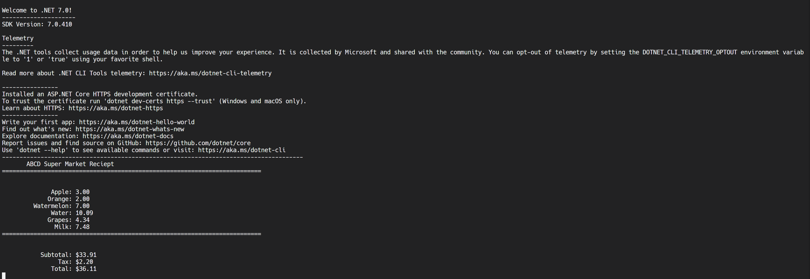

# Assignment 1: Grocery Receipt Calculator


A C# console application that calculates grocery bills, demonstrating fundamental programming concepts including variables, arithmetic operations, and formatted output.

## 📋 Overview

This beginner-level program simulates a simple grocery receipt system. Users enter prices for multiple items, and the program calculates subtotal, tax, and total cost. It's an excellent introduction to console I/O, mathematical calculations, and string formatting in C#.

## 📌 Program Details

| Property | Value |
|----------|-------|
| **Author** | Marlena Fabrick |
| **Language** | C# (.NET Core 3.1) |
| **Project Type** | Console Application |
| **Difficulty** | Beginner |
| **Key Topic** | Variables, Arithmetic, I/O |

## ✨ Features

✓ User input for item prices  
✓ Grocery item name entry  
✓ Automatic subtotal calculation  
✓ Tax calculation (6.5%)  
✓ Total cost computation  
✓ Formatted currency output  
✓ Professional receipt display  
✓ Input validation (numeric only)  

## 🚀 Getting Started

### Prerequisites

- .NET Core 3.1 SDK or later
- A code editor (Visual Studio, Visual Studio Code, or similar)
- Basic C# knowledge

### Installation

1. Clone this repository:
```bash
git clone https://github.com/MissMarzelous/A1_Reciepts_C-sharp.git
cd A1_Reciepts_C-sharp
```

2. Build the project:
```bash
dotnet build
```

3. Run the application:
```bash
dotnet run
```

## 📖 How to Use

1. **Start the program** - The application launches with a welcome message
2. **Enter items** - When prompted, type the name of each grocery item
3. **Enter quantities** - Input the number of items purchased
4. **Enter prices** - Input the price per item
5. **Add more items** - Continue adding items as needed
6. **View receipt** - After all items are entered, the program displays a formatted receipt

### Example Session

```
Enter the name of the item: Apples
Enter the quantity: 3
Enter the price per item: $2.50

Add another item? (y/n): y

Enter the name of the item: Milk
Enter the quantity: 2
Enter the price per item: $3.99

Add another item? (y/n): n

==========================RECEIPT==========================

Item              Qty    Price      Total
---------------------------------------------------
Apples            3      $2.50      $7.50
Milk              2      $3.99      $7.98

---------------------------------------------------
Subtotal:                           $15.48
Tax (6.5%):                         $1.01
Total:                              $16.49

===========================================================
```

## 💻 Code Structure

### Main Program Flow

```csharp
static void Main(string[] args)
{
    // 1. Initialize variables for storing item data
    List<string> itemNames = new List<string>();
    List<int> quantities = new List<int>();
    List<decimal> prices = new List<decimal>();
    decimal subtotal = 0;

    // 2. Loop to collect items from user
    while (true)
    {
        // Get item details
        // Store in lists
        // Calculate running subtotal
    }

    // 3. Calculate tax and total
    decimal tax = subtotal * 0.065m;
    decimal total = subtotal + tax;

    // 4. Display formatted receipt
    DisplayReceipt(itemNames, quantities, prices, subtotal, tax, total);
}
```

### Key Methods

**CalculateSubtotal()**
- Multiplies quantity × price for each item
- Maintains running total

**DisplayReceipt()**
- Formats and displays final receipt
- Uses string formatting for currency
- Aligns columns for readability

**GetValidInput()**
- Validates numeric input
- Prevents crashes from invalid data

## 🎓 Key Concepts Covered

| Concept | Implementation |
|---------|---|
| **Variables** | Storing item names, quantities, prices |
| **Collections** | Lists for dynamic item storage |
| **Arithmetic** | Multiplication, addition, percentage calculation |
| **Type Conversion** | String to decimal/int conversion |
| **String Formatting** | Currency display ($X.XX format) |
| **Loops** | While/foreach loops for user input and output |
| **Conditional Logic** | If-else for validation |
| **Console I/O** | ReadLine() for input, WriteLine() for output |
| **User Interaction** | Prompts and formatted output |

## 🎯 Learning Objectives

After completing this project, you should understand:

- ✓ How to collect and store user input
- ✓ How to perform mathematical calculations
- ✓ How to format currency for display
- ✓ How to create formatted output/receipts
- ✓ How to validate numerical input
- ✓ How to use collections (Lists)
- ✓ How to design user-friendly console applications
- ✓ Basic real-world application design

## 🏆 Skills Demonstrated

**Beginner Level:**
- Console.ReadLine() for input collection
- Console.WriteLine() for output
- String concatenation
- Basic arithmetic operations
- Simple loops and conditionals

**Intermediate Concepts:**
- List<T> collection usage
- Type conversion (string → decimal)
- Currency formatting
- Tab-based text alignment
- Input validation
- Program flow control

## 🔧 Enhancements & Extensions

### Possible Improvements

1. **Discount System**
   - Add percentage-based discounts
   - Implement coupon codes

2. **Payment Methods**
   - Calculate change for cash payments
   - Support multiple payment types

3. **Item Database**
   - Store common grocery prices
   - Auto-populate prices by item name

4. **Receipt Features**
   - Save receipt to file
   - Generate receipt number
   - Add date/time stamp

5. **Advanced Math**
   - Handle bulk pricing
   - Implement tiered discounts
   - Add loyalty point calculations

### Example Enhancement: Discount Feature

```csharp
// Add discount capability
decimal discountPercentage = GetDiscountFromUser();
decimal discountAmount = subtotal * (discountPercentage / 100);
decimal discountedSubtotal = subtotal - discountAmount;
decimal tax = discountedSubtotal * 0.065m;
```

## 🧪 Testing Scenarios

| Test Case | Input | Expected Output |
|-----------|-------|---|
| Single Item | 1 Banana, Qty 1, Price $0.99 | Subtotal $0.99, Tax $0.06, Total $1.05 |
| Multiple Items | 3 items with varying quantities | All calculations accurate, proper currency |
| Invalid Input | Non-numeric price (e.g., "abc") | Error handling, re-prompt |
| Zero Values | 0 quantity or $0.00 price | Handled gracefully |

## ⚠️ Common Issues & Solutions

| Issue | Solution |
|-------|----------|
| Decimal precision errors | Use `decimal` type instead of `float` |
| Formatting shows many decimals | Use `.ToString("C2")` for currency |
| Input crashes program | Implement try-catch or TryParse() |
| Negative prices allowed | Add validation check |
| Alignment issues | Use `PadRight()` or format strings |

## 📁 File Structure

```
A1_Reciepts_C-sharp/
├── Program.cs                      # Main program file
├��─ A1_Reciepts_C-sharp.csproj     # Project configuration
├── README.md                       # This file
└── LICENSE                         # MIT License
```

## 📦 Requirements & Dependencies

- .NET Core 3.1 SDK or higher
- C# 8.0 or compatible
- No external NuGet packages required

## ⚡ Compilation & Execution

### Using .NET CLI

```bash
# Restore dependencies
dotnet restore

# Build project
dotnet build

# Run project
dotnet run
```

### Using Visual Studio

1. Open `A1_Reciepts_C-sharp.csproj` in Visual Studio
2. Press `Ctrl+F5` to run without debugging
3. Or `F5` to run with debugging

## 🌍 Real-World Applications

This project demonstrates skills used in:

- **Point of Sale (POS) Systems** - Receipt calculation
- **Accounting Software** - Invoice generation
- **E-commerce** - Shopping cart calculations
- **Financial Applications** - Tax and discount calculations
- **Inventory Management** - Item tracking and costing

## 💼 Career Relevance

Understanding receipt/invoice calculations is fundamental for:
- Backend developers building payment systems
- Full-stack developers creating e-commerce platforms
- Financial software engineers
- Business application developers
- Accounting software developers

## 📊 Code Quality Metrics

| Metric | Rating | Notes |
|--------|--------|-------|
| Readability | ⭐⭐⭐⭐⭐ | Clear variable names, good comments |
| Maintainability | ⭐⭐⭐⭐ | Well-structured, could use methods |
| Error Handling | ⭐⭐⭐ | Basic validation present |
| Performance | ⭐⭐⭐⭐⭐ | Efficient for console app |
| Scalability | ⭐⭐⭐ | Lists allow multiple items |

## 🔍 Troubleshooting

### Program Won't Run

**Error:** `The specified framework '.NETCoreApp,version=3.1' was not found`
**Solution:** Install .NET Core 3.1 SDK from https://dotnet.microsoft.com/download

### Formatting Issues

**Issue:** Currency doesn't display with $ sign
**Solution:** Use `Math.Round(value, 2)` or `.ToString("C2")`

### Input Validation Fails

**Issue:** Non-numeric input crashes program
**Solution:** Use `decimal.TryParse()` instead of direct conversion

## 🚀 Future Enhancements

- [ ] Save receipts to text file
- [ ] Generate receipt ID/number
- [ ] Add timestamp to receipts
- [ ] Implement discount codes
- [ ] Create item database
- [ ] Add payment method options
- [ ] Calculate loyalty points
- [ ] Support multiple tax rates by region

## 📚 References & Resources

- [Microsoft C# Documentation](https://docs.microsoft.com/en-us/dotnet/csharp/)
- [.NET API Reference](https://docs.microsoft.com/en-us/dotnet/api/)
- [Console.WriteLine() Reference](https://docs.microsoft.com/en-us/dotnet/api/system.console.writeline)
- [Decimal Type Documentation](https://docs.microsoft.com/en-us/dotnet/api/system.decimal)


## 📸 Screenshots

### Console Output




## 👤 Author

**Marlena Fabrick**

## 📄 License

This project is licensed under the MIT License - see the [LICENSE](LICENSE) file for details.

---

## ✅ Quick Start Checklist

- [ ] Clone/download repository
- [ ] Verify .NET Core 3.1+ is installed
- [ ] Open project in IDE
- [ ] Build project (`dotnet build`)
- [ ] Run program (`dotnet run`)
- [ ] Test with sample input
- [ ] Review code and comments
- [ ] Modify and experiment

---

**Version:** 1.0  
**Last Updated:** June 2024  
**Status:** ✅ Complete & Tested
